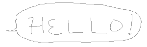
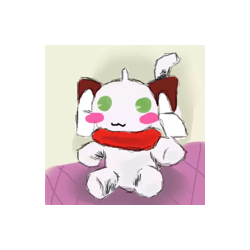

Welcome to domato's personal website!  
I may post something like dairy or stuffs I drew.  
Still building the website step by step...

Feel free to leave any comments or suggestions by [email](mailto:domato.contact@proton.me) on the bottom, or the comment section!

This site supports RSS subscriction!  
Right-click or long-press the third icon on the bottom of the website, and use a [RSS reader](https://duckduckgo.com/?q=rss+reader+open+source&rpl=1&atb=v522-1&ia=web) to subscribe the RSS link!

I use [Thunderbird](https://www.thunderbird.net/en-US/thunderbird/all/) as RSS reader by the way.

---

About Me
---

**About my avatar**  
I didn't want to make myself look like a bishoujo, but I don't want to draw a character looks too similar to me...  
Too lazy to re-design a new character for it, I end up using the old character I made when I was small for this purpose (for real?)  
This was what I drew when I was small ↓  
  
**About my name**  
I created a very silly Chinese name for net surfing when I was small.  
If a non-Chinese speaker would like to call my name however, it may not be convenience for them.  
Again I am too lazy to think of a new name  
therefore I arranged my original net-name a little bit and got the net-name I am using now.

**How should I call you, for real?**  
Some call me noodle, some call me tomato, some call me domato, some call me 🍅, and people may have called me other names I don't even remember.  
I don't really care how people call me, please pick whatever name you would like to call!
